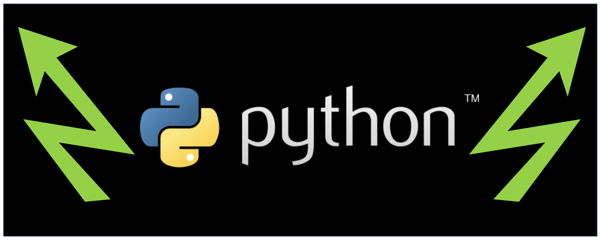

# Lab 02: Mastering Python Data Structures 📊

## Assigned and Due

**Assigned** : Friday 25th September 2026

Note: *This is a three week lab assignment which is to be completed by its expiration date due to fall break on the 8th - 11th October 2026.*

**Due** : Friday 16th October 2026

**Lab Expiration Date** : Friday 16th October 2026

Note: the _expiration_ date is the last date you can submit your work for a grade.



## 🎯 Learning Objectives

Welcome to Lab 02! This week, you'll master Python's most powerful data structures: lists, dictionaries, sets, and comprehensions. Each program will help you understand how to organize, manipulate, and transform data efficiently. Please note, that there may be parts of the lab that we have not yet covered in class. You are welcome to look these parts up and complete them yourself. Otherwise, we will cover these topics in class.

## 🎯 Learning Objectives

By the end of this lab, you will be able to:

- Create and manipulate lists using various methods and operations
- Work with dictionaries to store and access key-value pairs
- Use sets for unique collections and mathematical operations
- Write concise list comprehensions to transform data
- Create dictionary comprehensions for elegant data transformations
- Choose the right data structure for specific problems

## 📚 Lab Overview

Each of the five programs focuses on a different data structure, building your skills progressively. Please read this documentation to provide answers to questions that you might have.

## 🚀 Getting Started

1. **Create a local working space**: A local directory is used to keep all your labs together in the same spot on your local machine and will help you locate them for future use. Please note that these local repositories are **located on your machine** and will still need to be pushed to GitHub. The UNIX command to create a local directory `cs101Spring2026/labs` is as follows (if you are using a Windows machine, you can create the directory using File Explorer or use Git Bash to run the command below):

    ```bash
    mkdir -p cs101Spring2026/labs
    ```

Keep all your labs together in this local directory. If you are working with an activity, create a similar local directory for your course activities.

2. **Clone this repository** to your computer. Use the command: `git clone <your-repo-url>` to clone the repository.
3. **Open the `src/` folder** in your code editor
4. **Start with `program1.py`** and work your way through each program
5. **Look for TODO comments** - these tell you exactly where to add your code. Note: please be sure to REMOVE the `TODO` comments after you have completed each task.
6. **Run each program** to test your work and ensure that they execute correctly: `python3 src/program1.py`
7. **Fill out `writing/reflection.md`** when you are done with the coding part. Please remember to use clear and meaningful language in your response to questions.


## 📝 Program Descriptions

Below, we offer some information about each program to create for the lab. While there are perhaps many ways to complete the code, please be sure that your outputs appear as the following.

### Program 1: List Operations and Manipulation 📋

**File:** `src/program1.py`

**What You'll Learn:** Creating, modifying, and analyzing lists

**What It Does:**

- Creates and populates lists with data
- Adds items using `append()` and `insert()`
- Removes items using `remove()` and `pop()`
- Analyzes lists with `len()`, `sum()`, `max()`, and `min()`
- Sorts and reverses lists
- Performs list slicing operations

**Expected Output:**

```text
==================================================
Program 1: List Operations and Manipulation
==================================================

STEP 1: Creating a list
Original list: ['apple', 'banana', 'orange', 'strawberry', 'blueberry']

STEP 2: Adding items
After adding items: ['apple', 'banana', 'grape', 'orange', 'strawberry', 'blueberry', 'mango']

STEP 3: Removing items
Removed last item: mango
After removing items: ['apple', 'grape', 'orange', 'strawberry', 'blueberry']

STEP 4: List analysis
Length of numbers list: 7
Sum of all numbers: 208
Maximum value: 67
Minimum value: 8

STEP 5: Sorting and reversing
Sorted numbers: [8, 15, 19, 23, 34, 42, 67]
Reversed numbers: [67, 42, 34, 23, 19, 15, 8]

STEP 6: List slicing
First 3 elements: [67, 42, 34]
Last 3 elements: [19, 15, 8]
Every other element: [67, 34, 19, 8]

==================================================
Program 1 Complete!
==================================================
```

**Key Concepts:** List methods, mutability, list operations, slicing

---

### Program 2: Dictionary Operations and Manipulation 📖

**File:** `src/program2.py`

**What You'll Learn:** Working with key-value pairs in dictionaries

**What It Does:**

- Creates dictionaries with student and grade information
- Accesses values using bracket notation and `.get()`
- Adds and updates dictionary entries
- Removes entries using `del` and `.pop()`
- Iterates through keys, values, and items
- Checks for key membership

**Expected Output:**

```text
==================================================
Program 2: Dictionary Operations
==================================================

STEP 1: Creating a dictionary
Student information: {'name': 'Alice Johnson', 'age': 20, 'major': 'Computer Science', 'gpa': 3.7}

STEP 2: Accessing dictionary values
Student name: Alice Johnson
Student email: No email on file

STEP 3: Modifying the dictionary
Updated student: {'name': 'Alice Johnson', 'age': 21, 'major': 'Computer Science', 'gpa': 3.7, 'year': 'Junior', 'email': 'alice.johnson@university.edu'}

STEP 4: Removing entries
After removal: {'name': 'Alice Johnson', 'age': 21, 'major': 'Computer Science', 'year': 'Junior', 'email': 'alice.johnson@university.edu'}

STEP 5: Iterating through dictionary
All course names:
  Math
  English
  Science
  History

All grades:
  95
  88
  92
  85

Course grades:
  Math: 95
  English: 88
  Science: 92
  History: 85

STEP 6: Grade point conversion
Grade points: {'Math': 3.8, 'English': 3.52, 'Science': 3.68, 'History': 3.4}

STEP 7: Checking if keys exist
Physics grade not found
Math grade found: 95

==================================================
Program 2 Complete!
==================================================
```

**Key Concepts:** Key-value pairs, dictionary methods, `.items()`, `.keys()`, `.values()`, membership testing

---

### Program 3: Set Operations and Manipulation 🎲

**File:** `src/program3.py`

**What You'll Learn:** Working with unique collections using sets

**What It Does:**

- Creates sets and removes duplicates from lists
- Adds and removes elements using `.add()`, `.remove()`, `.discard()`
- Performs set operations: union, intersection, difference, symmetric difference
- Tests membership efficiently
- Finds unique words in text
- Uses set comprehensions

**Expected Output:**

```text
==================================================
Program 3: Set Operations
==================================================

STEP 1: Creating sets from lists
Original list: [1, 2, 2, 3, 4, 4, 4, 5, 6, 6, 7]
Unique numbers: {1, 2, 3, 4, 5, 6, 7}

STEP 2: Adding and removing set elements
After adding: {'red', 'blue', 'green', 'yellow', 'purple'}
After removing: {'red', 'green', 'yellow', 'purple'}

STEP 3: Set operations - Students in classes
Class A: {'Alice', 'Bob', 'Charlie', 'David', 'Eve'}
Class B: {'Charlie', 'David', 'Frank', 'Grace', 'Hannah'}

Students in both classes: {'Charlie', 'David'}
Students only in class A: {'Alice', 'Bob', 'Eve'}
All students: {'Alice', 'Bob', 'Charlie', 'David', 'Eve', 'Frank', 'Grace', 'Hannah'}
Students in exactly one class: {'Alice', 'Bob', 'Eve', 'Frank', 'Grace', 'Hannah'}

STEP 4: Fast membership testing
Alice is in class A
Frank is not in class A

STEP 5: Finding unique words in text
Original text: the quick brown fox jumps over the lazy dog the fox is quick
Unique words: {'fox', 'the', 'over', 'brown', 'jumps', 'dog', 'quick', 'is', 'lazy'}
Number of unique words: 9

STEP 6: Set comprehension
Squares of even numbers: {64, 4, 36, 100, 16}

==================================================
Program 3 Complete!
==================================================
```

**Key Concepts:** Unique collections, set operations (`|`, `&`, `-`, `^`), membership testing, set methods

---

### Program 4: List Comprehensions 🔄

**File:** `src/program4.py`

**What You'll Learn:** Creating lists concisely with comprehensions

**What It Does:**

- Creates lists using comprehension syntax
- Filters lists with conditions
- Transforms strings and extracts data
- Creates tuples and nested lists
- Flattens nested lists
- Uses if-else expressions in comprehensions

**Expected Output:**

```text
==================================================
Program 4: List Comprehensions
==================================================

STEP 1: Creating a list of squares
Traditional way: [1, 4, 9, 16, 25, 36, 49, 64, 81, 100]
List comprehension: [1, 4, 9, 16, 25, 36, 49, 64, 81, 100]

STEP 2: Filtering even numbers
Even numbers: [2, 4, 6, 8, 10, 12, 14, 16, 18, 20]

STEP 3: Converting strings to uppercase
Original: ['apple', 'banana', 'cherry', 'date', 'elderberry']
Uppercase: ['APPLE', 'BANANA', 'CHERRY', 'DATE', 'ELDERBERRY']

STEP 4: Extracting first characters
Words: ['Python', 'Java', 'Ruby', 'JavaScript', 'Go']
First letters: ['P', 'J', 'R', 'J', 'G']

STEP 5: Numbers divisible by 3 or 5
Numbers divisible by 3 or 5: [3, 5, 6, 9, 10, 12, 15, 18, 20, 21, 24, 25, 27, 30, 33, 35, 36, 39, 40, 42, 45, 48, 50]

STEP 6: Creating number-square pairs
Number-square pairs: [(1, 1), (2, 4), (3, 9), (4, 16), (5, 25), (6, 36), (7, 49), (8, 64), (9, 81), (10, 100)]

STEP 7: Creating a multiplication table
Multiplication table:
[1, 2, 3, 4, 5]
[2, 4, 6, 8, 10]
[3, 6, 9, 12, 15]
[4, 8, 12, 16, 20]
[5, 10, 15, 20, 25]

STEP 8: Flattening a nested list
Nested: [[1, 2, 3], [4, 5, 6], [7, 8, 9]]
Flattened: [1, 2, 3, 4, 5, 6, 7, 8, 9]

STEP 9: Labeling numbers as even or odd
Numbers: [1, 2, 3, 4, 5, 6, 7, 8, 9, 10]
Labels: ['odd', 'even', 'odd', 'even', 'odd', 'even', 'odd', 'even', 'odd', 'even']

==================================================
Program 4 Complete!
==================================================
```

**Key Concepts:** List comprehension syntax, filtering with conditions, nested comprehensions, if-else expressions

---

### Program 5: Dictionary Comprehensions 🗂️

**File:** `src/program5.py`

**What You'll Learn:** Creating dictionaries elegantly with comprehensions

**What It Does:**

- Creates dictionaries using comprehension syntax
- Builds dictionaries from multiple lists using `zip()` (Note: you may have to look up this function to employ it successfully.)
- Transforms dictionary values
- Filters dictionaries with conditions
- Swaps keys and values
- Uses complex conditional logic in comprehensions

**Expected Output:**

```text
==================================================
Program 5: Dictionary Comprehensions
==================================================

STEP 1: Creating a number-square dictionary
Traditional way: {1: 1, 2: 4, 3: 9, 4: 16, 5: 25}
Dict comprehension: {1: 1, 2: 4, 3: 9, 4: 16, 5: 25}

STEP 2: Creating dictionary from lists
Name-age dictionary: {'Alice': 20, 'Bob': 22, 'Charlie': 21, 'David': 23}

STEP 3: Mapping words to their lengths
Word lengths: {'python': 6, 'programming': 11, 'data': 4, 'structures': 10, 'comprehension': 13}

STEP 4: Filtering with conditions
Even numbers and squares: {2: 4, 4: 16, 6: 36, 8: 64, 10: 100}

STEP 5: Temperature conversion (Celsius to Fahrenheit)
Celsius: {'morning': 20, 'afternoon': 25, 'evening': 18, 'night': 15}
Fahrenheit: {'morning': 68.0, 'afternoon': 77.0, 'evening': 64.4, 'night': 59.0}

STEP 6: Swapping keys and values
Original: {'a': 1, 'b': 2, 'c': 3, 'd': 4}
Swapped: {1: 'a', 2: 'b', 3: 'c', 4: 'd'}

STEP 7: Converting percentage grades to letter grades
Percentages: {'Alice': 95, 'Bob': 87, 'Charlie': 76, 'David': 92, 'Eve': 68}
Letter grades: {'Alice': 'A', 'Bob': 'B', 'Charlie': 'C', 'David': 'A', 'Eve': 'D'}

STEP 8: Product price calculation with tax
Original prices: {'laptop': 999.99, 'mouse': 29.99, 'keyboard': 79.99, 'monitor': 299.99}
Prices with tax: {'laptop': 1079.99, 'mouse': 32.39, 'keyboard': 86.39, 'monitor': 323.99}

STEP 9: Building dictionary with multiple conditions
FizzBuzz dictionary: {1: 1, 2: 2, 3: 'fizz', 4: 4, 5: 'buzz', 6: 'fizz', 7: 7, 8: 8, 9: 'fizz', 10: 'buzz', 11: 11, 12: 'fizz', 13: 13, 14: 14, 15: 'fizzbuzz', 16: 16, 17: 17, 18: 'fizz', 19: 19, 20: 'buzz'}

==================================================
Program 5 Complete!
==================================================
```

**Key Concepts:** Dictionary comprehension syntax, `zip()`, value transformation, conditional dictionary building


## 💡 Hints and Tips

### General Tips

- **Start simple**: Test each TODO one at a time before moving to the next
- **Read the hints**: Each TODO has a hint comment to guide you
- **Check the expected output**: Compare your output to what's shown above
- **Use print statements**: Add extra prints to debug your code
- **Ask for help**: If you're stuck for more than 15 minutes, reach out!
- **Submit incremental changes**: Submitting small amounts of work at a time will help you to conveniently fine code that caused interruptions in your code (i.e., bugs).

### Program-Specific Tips

Below we offer some last minute details or ideas that you may want to consider when working with your code.

**Program 1 - Lists:**

- Remember: list indices start at 0
- Use negative indices to access from the end: `my_list[-1]` gets the last item
- Slicing syntax: `list[start:stop:step]`

**Program 2 - Dictionaries:**
- Use `.get()` for safe access with default values
- Use `.items()` to loop through both keys and values
- Check membership with `if key in dictionary:`

**Program 3 - Sets:**
- Sets automatically remove duplicates
- Use `&` for intersection, `|` for union, `-` for difference, `^` for symmetric difference
- Sets are unordered - don't rely on element order

**Program 4 - List Comprehensions:**
- Basic syntax: `[expression for item in iterable]`
- With condition: `[expression for item in iterable if condition]`
- With if-else: `[expr1 if condition else expr2 for item in iterable]`

**Program 5 - Dictionary Comprehensions:**
- Basic syntax: `{key: value for item in iterable}`
- Use `zip()` to combine lists: `zip(list1, list2)`
- Chain if-else for complex conditions: `"A" if x >= 90 else "B" if x >= 80 else "C"`


## 🧪 Testing Your Work

Before you submit your work, please determine that each of your programs executes successfully.

```bash
python3 src/program1.py
python3 src/program2.py
python3 src/program3.py
python3 src/program4.py
python3 src/program5.py
```

In addition, please be sure that Gatorgrade is satisfied with a green checkmark in your project website at Github.


## 📝 Reflection Questions

After completing all programs, answer the questions in `writing/reflection.md`. These questions help you think conceptually about data structures and their applications.


## 📤 Submission

1. **Commit your changes**:

   ```bash
   git add .
   git commit -m "Complete lab02 programs and reflection"
   ```
Note: please push small and incremental changes to Github. This will help to to locate commits which causes errors, and will satisfy a Gatorgrade requirement.


2. **Push to GitHub**:
 
   ```bash
   git push origin main
   ```

3. **Verify**: Check your project site at GitHub to ensure all files are uploaded


Students who have questions about this project outside of the lab time are invited to ask them in the course's Discord channel or during instructor's or TL's office hours.
